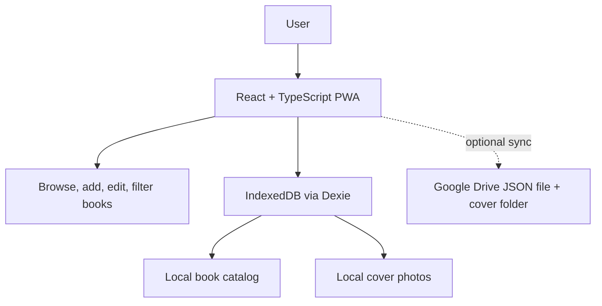
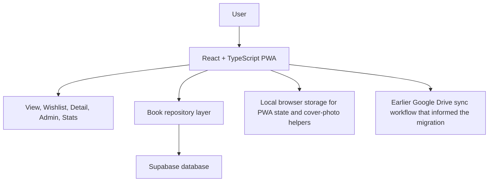

# Jenkins Library

Recruiter-facing overview of a personal product I built to manage a real book collection. This project is valuable because it shows iterative software development in practice: I started with a simple offline-first solution, shipped something useful, then evolved the architecture as the product's needs became clearer.

## Summary

Jenkins Library started as a simple way to manage my personal book collection. I built the application in stages, first creating a fully offline catalog stored in the browser. I later added a Google Drive sync workflow to move data between devices before ultimately migrating the system to a centralized database for a more reliable long-term architecture. The project reflects an iterative approach to building software: identifying a real need, shipping a working solution, and improving the system as requirements became clearer.

## Highlights

- Built an offline-first catalog using IndexedDB and Dexie for fast local book management.
- Implemented a Google Drive JSON sync workflow to experiment with cross-device data sharing.
- Migrated the system to a centralized database for more reliable storage and multi-device usage.
- Designed React + TypeScript interfaces for browsing, adding, and editing books.

## Architecture Evolution

### Stage 1 and 2: Offline-first catalog, then Drive sync



### Current architecture: centralized data with a more reliable long-term model



## Project Goal

This project began with a simple personal need: keep track of books I own, books I want, and reading progress without relying on a generic notes app or spreadsheet. The real value of the project is not just the final UI. It is the way the architecture evolved based on actual usage:

- first prioritize speed and offline availability
- then solve the problem of using the app across devices
- then replace a fragile sync workflow with a more reliable centralized model

That progression mirrors how real products often grow. The first version should solve the core problem. Later versions should respond to what the first version teaches you.

## What The App Does

- Tracks a personal library of owned books
- Separates wishlist items from owned books
- Supports adding, editing, deleting, and viewing detailed book records
- Stores metadata such as author, genre, description, ISBN, read status, series, and ownership state
- Tracks shared reading status with fields like `readByDane` and `readByEmma`
- Supports cover images through URLs and locally saved cover photos
- Includes a stats page for collection and reading summaries
- Works as a Progressive Web App so it can behave more like an installed app

## Why The Architecture Changed

The most important story in this project is the architecture evolution:

- I started with IndexedDB and Dexie because they were a good fit for a fast offline-first personal tool.
- Once I wanted the catalog available across devices, local-only storage was no longer enough.
- I added a Google Drive sync workflow that exported the catalog to JSON and synced cover images through Drive folders. That was a practical experiment that extended the app without immediately introducing a full backend.
- As the product matured, I moved the core catalog to Supabase because a centralized database is more reliable for long-term multi-device usage than a manual file-sync workflow.

This is the kind of tradeoff I want recruiters to see: I do not force the final architecture too early, but I also do not stay with a temporary solution once the product outgrows it.

## Technical Work Explained Simply

- `React` powers the UI and makes it easier to break the app into reusable screens and components.
- `TypeScript` helps keep the data model and feature changes safer as the app grows.
- `Vite` gives fast local development and lean production builds.
- `React Router` organizes the app into focused views like browsing, admin management, wishlist, detail pages, and stats.
- `vite-plugin-pwa` turns the project into a Progressive Web App with installable behavior and offline-friendly caching.
- `Dexie` provides a clean way to work with `IndexedDB`, which powered the original offline-first data model and still supports local storage concerns like saved cover photos and settings.
- `Google Drive` sync was implemented as a JSON export/import workflow plus cover-photo folder sync to test cross-device portability before introducing a centralized backend.
- `Supabase` now provides the more reliable system of record for books and related data such as series relationships.

## Product And Engineering Decisions

- I used an offline-first approach at the beginning because the fastest path to a useful product was local storage in the browser.
- I treated Google Drive sync as an intermediate step rather than pretending it was the permanent answer.
- I introduced a repository layer so the UI could depend on book operations without being tightly coupled to one storage implementation.
- I kept improving the data model as the app became more useful, adding support for wishlist items, series metadata, cover handling, and richer book details.
- I kept the app usable while changing the underlying architecture, which is the kind of migration work real products require.

## Main Screens

- `/view` for browsing the library
- `/wishlist` for books not yet owned
- `/book/:id` for individual book details
- `/admin` for creating and editing records
- `/stats` for collection metrics and reading progress

## Business Value, Even As A Personal Project

Although this is a personal project, it still demonstrates business-relevant skills:

- identifying a concrete user need instead of building a project with no real purpose
- shipping a working product before overengineering
- evolving architecture based on actual limitations
- designing for maintainability while requirements change
- balancing product speed against long-term reliability

## Ongoing Development

This project reflects a continuing development process rather than a one-time prototype. The codebase still carries evidence of the product's earlier stages, which is useful because it shows the path from local-only storage, to sync experimentation, to a more stable centralized architecture.

## Local Development

```bash
npm install
npm run dev
```

## Environment variables

Supply the same Vite env vars that power the running demo:

- `VITE_SUPABASE_URL`
- `VITE_SUPABASE_ANON_KEY`
- `VITE_DATA_SOURCE=supabase`
- `VITE_SUPABASE_SCHEMA` (set this to the schema your catalog lives in, e.g. `library`; leave it blank only if you explicitly want Supabase's default `public` schema)

## Recruiter Takeaway

This project demonstrates that I can:

- build a useful product from a real need
- design and ship offline-first experiences
- experiment with transitional architectures instead of overcommitting too early
- migrate a product from local storage to a centralized backend
- maintain a React + TypeScript codebase as it grows in complexity
